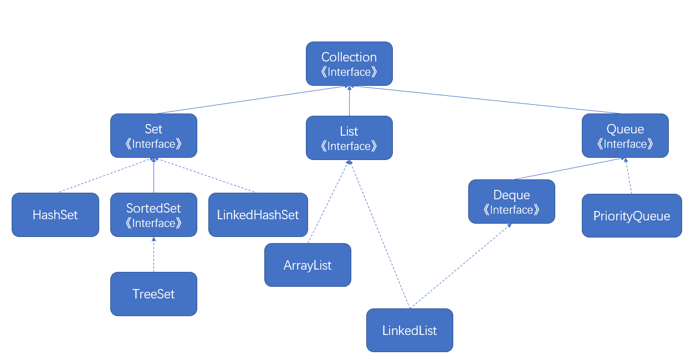

## Java容器

[TOC]

Java集合的两大接口是`Collection`和`Map`，`Collection`主要用于存储单个对象，Map主要用于存储键值对（键和值是两个对象）

### 一、Collection



#### List

+ ArrayList:基于数组的实现，相对于LinkedList长于随机查找，短于插入和删除。
+ LinkedList：基于链表的实现，内部维护了一个双向链表
+ Vector：基于数组实现，但是内部的方法标识了`synchronized`关键字。

#### Set

+ HashSet：基于hash表实现，查找速度为O(1)，不支持有序性的操作，比如在通过使用Iterator遍历Set集合时，得到的结果是无序的。
+ TreeSet：基于红黑树实现，按照比较结果的升序保存对象，支持有序性的操作，可以进行范围查找，如果需要将自定义的对象放入Set集合，需要实现Comparable接口。
+ LinkedHashSet：具有了HashSet的查找效率（LinkedHashSet继承了HashSet），内部使用了双链表维护了插入的顺序
+ HashTable：线程安全的Map类，内部是基于Synchronized关键字实现，但是它是遗留类，性能相对于ConcurrentHashMap较差，不应该使用它。

#### Queue

+ LinkedList：实现了Deque接口，可以用了做单向队列，也可以做双向队列。
+ PriorityQueue：优先级队列，基于堆结构实现

### 二、Map


+ HashMap：基于哈希表实现，内部元素无序。
+ TreeMap：基于红黑树实现，按照比较结果的升序保存键。
+ LinkedHashMap：使用双向链表维护了元素的顺序，顺序为插入的顺序（默认）或者为LRU顺序。

### 三、源码分析

#### ArrayList

##### 1.基本信息

实现的接口和继承的类有

```JAVA
public class ArrayList<E> extends AbstractList<E>
        implements List<E>, RandomAccess, Cloneable, java.io.Serializable
```

初始的容量为：

```JAVA
private static final int DEFAULT_CAPACITY = 10;
```

一般来讲对于一个List集合，通用的操作通常是插入、删除、修改、查找、扩容以及序列化和反序列化。

##### 2.扩容

在对一个List进行add操作的时候，会首先判断List的容量，不够就执行扩容操作。

```JAVA
    public boolean add(E e) {
        ensureCapacityInternal(size + 1);  // Increments modCount!!
        elementData[size++] = e;
        return true;
    }
```

上述的函数`ensureCapacityInternal`就是用来执行扩容操作的，入参就是当前List需要的最小的容量。最终执行扩容操作的方法是`grow`方法

```JAVA
    private void ensureCapacityInternal(int minCapacity) {
        ensureExplicitCapacity(calculateCapacity(elementData, minCapacity));
    }

    private void ensureExplicitCapacity(int minCapacity) {
        modCount++;

        // overflow-conscious code
        // 如果需要的最小的容量大于当前数组的容量，执行扩容操作
        if (minCapacity - elementData.length > 0)
            grow(minCapacity);
    }

    private static int calculateCapacity(Object[] elementData, int minCapacity) {
        if (elementData == DEFAULTCAPACITY_EMPTY_ELEMENTDATA) {
            return Math.max(DEFAULT_CAPACITY, minCapacity);
        }
        return minCapacity;
    }

    private void grow(int minCapacity) {
        // overflow-conscious code
        int oldCapacity = elementData.length;
        // 由此可看出是执行的1.5倍扩容
        int newCapacity = oldCapacity + (oldCapacity >> 1);
        if (newCapacity - minCapacity < 0)
            newCapacity = minCapacity;
        if (newCapacity - MAX_ARRAY_SIZE > 0)
            newCapacity = hugeCapacity(minCapacity);
        // minCapacity is usually close to size, so this is a win:
        elementData = Arrays.copyOf(elementData, newCapacity);
    }
```

##### 3.删除操作

删除操作调用了一个native方法`System.arraycopy()`，基本的数据结构知识，将索引的后面部分向前复制一个单位。删除操作的时间复杂度是O(n)，因为找到元素在数组中的操作是O(1)，但是删除元素的后续元素需要向前复制，这个操作是O(n)。

```JAVA
    public E remove(int index) {
        rangeCheck(index);

        modCount++;
        E oldValue = elementData(index);

        int numMoved = size - index - 1;
        if (numMoved > 0)
            System.arraycopy(elementData, index+1, elementData, index,
                             numMoved);
        elementData[--size] = null; // clear to let GC do its work

        return oldValue;
    }
```

##### 4.fail-fast机制

在ArrayList中维护了一个modCount的实例变量来记录集合List被更改的次数（扩容、删除），查看过源码，更改操作modCount是不计数的。

在进行序列化`writerObject`和迭代操作的时候，如果操作前（expectModCount）后（modCount）发生了改变，会抛出`ConcurrentModificationException`。

```JAVA
    private void writeObject(java.io.ObjectOutputStream s)
        throws java.io.IOException{
        // Write out element count, and any hidden stuff
        int expectedModCount = modCount;
        s.defaultWriteObject();

        // Write out size as capacity for behavioural compatibility with clone()
        s.writeInt(size);

        // Write out all elements in the proper order.
        for (int i=0; i<size; i++) {
            s.writeObject(elementData[i]);
        }

        if (modCount != expectedModCount) {
            throw new ConcurrentModificationException();
        }
    }
```

##### 5.序列化-反序列化

Java中的类实现了`Serializable`标识了该类可以被序列化和反序列化。但是

```JAVA
transient Object[] elementData; // non-private to simplify nested class access
```

存储元素的数组前面标识了`transient`关键字，也就是存储数组不支持原生的序列化，如果对这个数组序列化会将不存储内容的那部分也序列化掉，占用额外的空间。ArrayList实现了`writeObject`和`readObject`来对存储有内容的那部分数组进行了序列化和反序列化。

```JAVA
    private void writeObject(java.io.ObjectOutputStream s)
        throws java.io.IOException{
        // Write out element count, and any hidden stuff
        int expectedModCount = modCount;
        s.defaultWriteObject();

        // Write out size as capacity for behavioural compatibility with clone()
        s.writeInt(size);

        // Write out all elements in the proper order.
        for (int i=0; i<size; i++) {
            s.writeObject(elementData[i]);
        }

        if (modCount != expectedModCount) {
            throw new ConcurrentModificationException();
        }
    }

    private void readObject(java.io.ObjectInputStream s)
        throws java.io.IOException, ClassNotFoundException {
        elementData = EMPTY_ELEMENTDATA;

        // Read in size, and any hidden stuff
        s.defaultReadObject();

        // Read in capacity
        s.readInt(); // ignored

        if (size > 0) {
            // be like clone(), allocate array based upon size not capacity
            int capacity = calculateCapacity(elementData, size);
            SharedSecrets.getJavaOISAccess().checkArray(s, Object[].class, capacity);
            ensureCapacityInternal(size);

            Object[] a = elementData;
            // Read in all elements in the proper order.
            for (int i=0; i<size; i++) {
                a[i] = s.readObject();
            }
        }
    }
```

从上面的源码可以看出，扩容操作不止发生在添加元素的时候，还发生在反序列化的时候。

##### 5.相关设计模式

+ 迭代器模式：提供了一种方法可以顺序的访问聚合对象中的元素，主要用来遍历一个聚合对象。

```JAVA
ListIterator<String> lt = list.listIterator();
Iterator<String> lt = list.iterator();
```

+ 适配器模式：将一个类的接口转换成客户希望的另外一个接口，适配器模式使得由于接口不兼容不能一起工作的那些类可以一起工作。

```JAVA
Arrays.asList();
```

#### Vector

Vector可以理解为一个线程安全的ArrayList，开销比ArrayList大，访问速度慢。

Vector的扩容操作是2倍扩容，而ArrayList是1.5倍扩容。

##### 1.替代方案

（1）可以采用Collections工具类下的静态内部类`Collections.SynchronizedList`，创建线程安全的List。

```JAVA
List<Integer> list = new ArrayList<>();
List<Integer> newList = Collections.synchronizedList(list);
```

（2）可以使用j.u.c下的`CopyOnWriteArrayList`

```JAVA
public class CopyOnWriteArrayList<E>
    implements List<E>, RandomAccess, Cloneable, java.io.Serializable {
```

在CopyOnWriteArrayList内部使用了`ReentrantLock`维护线程安全。

#### CopyOnWriteArrayList

CopyOnWriteArrayList的实现很有意思，它采用了`读写分离`的思想。

对于它的每次写操作都需要将原来的元素拷贝到一个新数组，将新元素写入拷贝的新数组中。

```JAVA
    public boolean add(E e) {
        final ReentrantLock lock = this.lock;
        lock.lock();
        try {
            Object[] elements = getArray();
            int len = elements.length;
            Object[] newElements = Arrays.copyOf(elements, len + 1);
            newElements[len] = e;
            setArray(newElements);
            return true;
        } finally {
            lock.unlock();
        }
    }
```

它的读操作没有加锁，读取到的不一定是最新的元素

```JAVA
    public E get(int index) {
        return get(getArray(), index);
    }
```

**总结**：可以分析得出CopyOnWriteArrayList适用于`读多写少`的场景，并且实时性要求不能太高，对内存要求不太敏感。

CopyOnWriteArrayList的缺陷：

+ 内容占用较大，写操作需要将元素复制到新数组，这个过程需要原数组两倍的空间
+ 不能保证实时性

#### LinkedList

##### 1.基本信息

```JAVA
public class LinkedList<E>    extends AbstractSequentialList<E>    implements List<E>, Deque<E>, Cloneable, java.io.Serializable
```

可以看出LinkedList不仅实现了List接口，还实现了双向队列`Deque`，而`Deque`接口继承了`Queue`接口，所以LinkedList属于队列的实现。

LinkedList有一个内部类`Node`，用于维护内部元素的双向链表

```JAVA
    private static class Node<E> {
        E item;
        Node<E> next;
        Node<E> prev;

        Node(Node<E> prev, E element, Node<E> next) {
            this.item = element;
            this.next = next;
            this.prev = prev;
        }
    }
```

LinkedList的add(E)添加到双向队列末尾时间复杂度是O(1)，get(int)操作需要遍历双向链表，时间复杂度是O(n)，add(int, E)需要遍历双向链表，时间复杂度是O(n)，remove(int)操作的时间复杂度是O(n)。

##### 2.查找

根据双向链表的特性，LinkedList的查找是经过优化的，当前的索引处于链表的前一半时，从前往后查找，后一半时，从后往前查找。

```JAVA
    Node<E> node(int index) {
        // assert isElementIndex(index);

        if (index < (size >> 1)) {
            Node<E> x = first;
            for (int i = 0; i < index; i++)
                x = x.next;
            return x;
        } else {
            Node<E> x = last;
            for (int i = size - 1; i > index; i--)
                x = x.prev;
            return x;
        }
    }
```

#### ArrayList和LinkedList使用场景分析

ArrayList基于动态数组实现，随机查找效率较快，在元素中间增加元素和删除元素效率较低，所以ArrayList适合经常查找的场景。

LinkedList基于双向链表实现，插入元素和删除元素较快，适用于经常插入和删除元素的场景，但是查找元素需要遍历。

#### HashMap

HashMap内部使用了非常复杂的机制，基于哈希表的方法存储元素，查找元素的时间复杂度是O(1)。

HashMap的内部采用了除留余数法来定位位置，采用拉链法（数组+链表）的形式来解决哈希冲突。

解决哈希冲突的方法有：

+ 拉链法
+ 开放地址法，发生哈希冲突后，采用某种探测机制确认合适的存放位置。
  1. 线性探测法，采用大小为M的数组保存N个键值对，M>N，需要数组中的空位解决碰撞冲突。当发生哈希冲突时，直接将索引位置加1，探测下一个位置是否也发生了哈希冲突，如果没有发生，就直接插入，如果发生了，继续探测。缺点是可能发生聚集现象。
  2. 二次探测法，探测间隔的增加和散列值成正比。
  3. 双重散列法，预备两个散列函数，探测间隔由另一个散列函数生成。
+ 再哈希法，设定多个哈希函数，如果一个哈希函数发生冲突，就试另外一个，直到哈希不冲突为止。

##### 1.基本信息

源码的分析基于JDK8。

```JAVA
public class HashMap<K,V> extends AbstractMap<K,V>
    implements Map<K,V>, Cloneable, Serializable {
```

存储元素的结构为一个Node数组

```JAVA
    transient Node<K,V>[] table;
```

Node的基本结构为

```JAVA
    static class Node<K,V> implements Map.Entry<K,V> {
        final int hash;
        final K key;
        V value;
        Node<K,V> next;

        Node(int hash, K key, V value, Node<K,V> next) {
            this.hash = hash;
            this.key = key;
            this.value = value;
            this.next = next;
        }

        public final K getKey()        { return key; }
        public final V getValue()      { return value; }
        public final String toString() { return key + "=" + value; }

        public final int hashCode() {
            return Objects.hashCode(key) ^ Objects.hashCode(value);
        }

        public final V setValue(V newValue) {
            V oldValue = value;
            value = newValue;
            return oldValue;
        }

        public final boolean equals(Object o) {
            if (o == this)
                return true;
            if (o instanceof Map.Entry) {
                Map.Entry<?,?> e = (Map.Entry<?,?>)o;
                if (Objects.equals(key, e.getKey()) &&
                    Objects.equals(value, e.getValue()))
                    return true;
            }
            return false;
        }
    }
```

根据`Node`的基本结构可以看出，HashMap中保存了一个Node数组，用于存储Node节点，Node节点本身也保存了hash的key信息。

为了保证hash值的均匀性，计算key的hash值并不是直接使用hashCode，而是采用了扰动函数的机制（hashCode的高16位和低16位异或）。

```JAVA
    static final int hash(Object key) {
        int h;
        return (key == null) ? 0 : (h = key.hashCode()) ^ (h >>> 16);
    }
```


##### 2.插入

在插入的时候首先需要计算key的哈希值，然后根据哈希方案的`除留余数法`定位到对应的存储桶，key的hash值的计算方式是

```JAVA
    static final int hash(Object key) {
        int h;
        return (key == null) ? 0 : (h = key.hashCode()) ^ (h >>> 16);
    }
```

插入元素的方式是

```JAVA
    final V putVal(int hash, K key, V value, boolean onlyIfAbsent,
                   boolean evict) {
        Node<K,V>[] tab; Node<K,V> p; int n, i;
        // 可以看出HashMap的table数组采用了惰性初始化的方式，也就是在使用的时候才开始进行扩容操作
        if ((tab = table) == null || (n = tab.length) == 0)
            n = (tab = resize()).length;
        // 如果对应的存储桶为空，此处采用的位操作，定位数组下标的方式等价于(i = hash % n)
        if ((p = tab[i = (n - 1) & hash]) == null)
            tab[i] = newNode(hash, key, value, null);
        else {
            Node<K,V> e; K k;
            // 和存储桶中链表的头结点的哈希值进行比较
            // 判断在哈希值相等的情况下，它们的key相不相等，判断key相等的方式就是用==/equals方法比较
            if (p.hash == hash &&
                ((k = p.key) == key || (key != null && key.equals(k))))
                e = p;
            else if (p instanceof TreeNode)
                e = ((TreeNode<K,V>)p).putTreeVal(this, tab, hash, key, value);
            else {
                for (int binCount = 0; ; ++binCount) {
                    if ((e = p.next) == null) {
                        p.next = newNode(hash, key, value, null);
                        if (binCount >= TREEIFY_THRESHOLD - 1) // -1 for 1st
                            treeifyBin(tab, hash);
                        break;
                    }
                    if (e.hash == hash &&
                        ((k = e.key) == key || (key != null && key.equals(k))))
                        break;
                    p = e;
                }
            }
            if (e != null) { // existing mapping for key
                V oldValue = e.value;
                if (!onlyIfAbsent || oldValue == null)
                    e.value = value;
                afterNodeAccess(e);
                return oldValue;
            }
        }
        ++modCount;
        // 此处的size表示在当前Map容器中key-value的数目，如果大于阈值，则扩容
        if (++size > threshold)
            resize();
        afterNodeInsertion(evict);
        return null;
    }
```

所以添加元素的操作的步骤为：

+ 当前的Node数组是否为空，初次访问一定为空，惰性初始化，对数组执行初始化操作，分配内存空间。
+ 数组的每个位置都是一个存储桶，每个节点可以作为链表的节点，它含有一个next的引用。通过除留余数法定位存储桶的位置（index = hash & (table.length - 1)）,如果为空，那么往该下标对应的存储桶添加元素，添加过程完成
+ 如果定位存储桶的下标发现当前存储桶中有元素，说明发生了哈希冲突，剩下的工作也就是在哈希值相等的情况下判断是否有这个key，此时在存储桶内的数据结构可能是`红黑树`，也可能是`链表`。将采用各自数据结构的处理方式，处理当前节点。对于链表，如果哈希值相等，且不存在当前key，那么将当前节点通过`尾插`的方式加入链表，如果存在当前key，那么需要根据onlyIfAbsent来判断是否替换对应的value值。对于红黑树也采用类似的操作。

存储桶中元素的个数在大于8的时候转为红黑树，如果个数小于6再次退化为链表。因为红黑树的插入、删除、查找的时间复杂度为`lg(n)`。

##### 3.扩容操作

假设容器存储的键值对的总的容量是M，存储桶的容量是N，每个存储桶对应链表的平均长度为M/N，做一个极端假设，如果存储桶的容量为1，那么链表的长度就变为M，hash的时间复杂度将不再是O(1)，而退化为O(M)，为了保证查找的时间和空间上的妥协，HashMap采用的动态数组的形式，达到一定的阈值就开始扩容。

关于扩容操作的参数主要有：

+ capacity：table数组的长度，默认的长度为16。
+ size：容器中存储的键值对的数量

+ loadFactor：负载因子，默认为0.75f
+ threshold：当前容器size的临界值，当size大于threshold，容器开始扩容。threshold的计算方式是`capacity *loadFactor`

**总结**：也就是说如果size > threshold，其中`threshold=capacity*loadFactor`那么当前的table开始两倍扩容。

```JAVA
    final Node<K,V>[] resize() {
        Node<K,V>[] oldTab = table;
        int oldCap = (oldTab == null) ? 0 : oldTab.length;
        int oldThr = threshold;
        int newCap, newThr = 0;
        if (oldCap > 0) {
            if (oldCap >= MAXIMUM_CAPACITY) {
                threshold = Integer.MAX_VALUE;
                return oldTab;
            }
            else if ((newCap = oldCap << 1) < MAXIMUM_CAPACITY &&
                     oldCap >= DEFAULT_INITIAL_CAPACITY)
                newThr = oldThr << 1; // double threshold
        }
        else if (oldThr > 0) // initial capacity was placed in threshold
            newCap = oldThr;
        else {               // zero initial threshold signifies using defaults
            newCap = DEFAULT_INITIAL_CAPACITY;
            newThr = (int)(DEFAULT_LOAD_FACTOR * DEFAULT_INITIAL_CAPACITY);
        }
        if (newThr == 0) {
            float ft = (float)newCap * loadFactor;
            newThr = (newCap < MAXIMUM_CAPACITY && ft < (float)MAXIMUM_CAPACITY ?
                      (int)ft : Integer.MAX_VALUE);
        }
        threshold = newThr;
        @SuppressWarnings({"rawtypes","unchecked"})
            Node<K,V>[] newTab = (Node<K,V>[])new Node[newCap];
        table = newTab;
        // 如果原数组不为空，也就是HashMap容器内部有数值
        if (oldTab != null) {
            // 遍历table数组
            for (int j = 0; j < oldCap; ++j) {
                Node<K,V> e;
                // 如果每个存储桶对应的元素不为空
                if ((e = oldTab[j]) != null) {
                    oldTab[j] = null;
                    // 1.如果存储桶内只有一个元素，也就链表只有一个头结点，那么就采用除留余数法定位
                    if (e.next == null)
                        newTab[e.hash & (newCap - 1)] = e;
                    // 2.红黑树的处理方法
                    else if (e instanceof TreeNode)
                        ((TreeNode<K,V>)e).split(this, newTab, j, oldCap);
                    else { // preserve order
                        // 3.如果链表有多个元素，且没有构成红黑树，说明原来链表的元素个数小于8个
                        Node<K,V> loHead = null, loTail = null;
                        Node<K,V> hiHead = null, hiTail = null;
                        Node<K,V> next;
                        do {
                            next = e.next;
                            // 基于此条件将原来的链表分为两个链表，头结点分别为loHead和hiHead
                            if ((e.hash & oldCap) == 0) {
                                if (loTail == null)
                                    loHead = e;
                                else
                                    loTail.next = e;
                                loTail = e;
                            }
                            else {
                                if (hiTail == null)
                                    hiHead = e;
                                else
                                    hiTail.next = e;
                                hiTail = e;
                            }
                        } while ((e = next) != null);
                        if (loTail != null) {
                            loTail.next = null;
                            newTab[j] = loHead;
                        }
                        if (hiTail != null) {
                            hiTail.next = null;
                            newTab[j + oldCap] = hiHead;
                        }
                    }
                }
            }
        }
        return newTab;
    }
```

在扩容操作中的步骤为：

+ 首先判断当前的数组是`initializes`还是`double table size`

+ 遍历原`table`数组对逐个存储桶进行操作，主要分三步：

  1.如果当前存储桶只有一个节点，那么根据公式`hash&(newCap - 1)`重新计算存储桶的位置

  2.如果为链表，将原来的链表分为两个链表(分为两个链表的公式为hash&oldCap)，头结点分别为`loHead`和`hiHead`。链表拆分完成后，头结点hiHead的链表处于高位，即原存储桶下标i+oldCap，头节点为loHead的链表处于低位。

  3.如果为红黑树，做法和基于链表的大同小异，首先遍历红黑树结构，构造两个链表，头结点分别为loHead和hiHead，遍历完成之后，对两条链表的个数进行判断，如果符合树化的条件，那么就转化为红黑树。

##### 4.HashMap和Hashtable的比较

+ Hashtable是一个线程安全的Map，内部的方法都标识了`Synchronized`关键字来进行同步。
+ HashMap内部也是采用的基于`Fail-Fast`的迭代器。
+ HashMap的key和value都为null，Hashtable的key和value都不可以。

#### ConcurrentHashMap

ConcurrentHashMap是HashMap的线程安全版本，和Hashtable不同，它采用了分段锁机制，并发性能较高。

##### 1.基本信息

```JAVA
public class ConcurrentHashMap<K,V> extends AbstractMap<K,V>
    implements ConcurrentMap<K,V>, Serializable {
```

内部的构造和HashMap大体相似，也是有一个Node的内部类。

```JAVA
    static class Node<K,V> implements Map.Entry<K,V> {
        final int hash;
        final K key;
        volatile V val;
        volatile Node<K,V> next;

        Node(int hash, K key, V val, Node<K,V> next) {
            this.hash = hash;
            this.key = key;
            this.val = val;
            this.next = next;
        }

        public final K getKey()       { return key; }
        public final V getValue()     { return val; }
        public final int hashCode()   { return key.hashCode() ^ val.hashCode(); }
        public final String toString(){ return key + "=" + val; }
        public final V setValue(V value) {
            throw new UnsupportedOperationException();
        }

        public final boolean equals(Object o) {
            Object k, v, u; Map.Entry<?,?> e;
            return ((o instanceof Map.Entry) &&
                    (k = (e = (Map.Entry<?,?>)o).getKey()) != null &&
                    (v = e.getValue()) != null &&
                    (k == key || k.equals(key)) &&
                    (v == (u = val) || v.equals(u)));
        }

        /**
         * Virtualized support for map.get(); overridden in subclasses.
         */
        Node<K,V> find(int h, Object k) {
            Node<K,V> e = this;
            if (k != null) {
                do {
                    K ek;
                    if (e.hash == h &&
                        ((ek = e.key) == k || (ek != null && k.equals(ek))))
                        return e;
                } while ((e = e.next) != null);
            }
            return null;
        }
    }
```

##### 2.插入元素的操作

```JAVA
final V putVal(K key, V value, boolean onlyIfAbsent) {
        if (key == null || value == null) throw new NullPointerException();
        int hash = spread(key.hashCode());
        int binCount = 0;
        for (Node<K,V>[] tab = table;;) {
            Node<K,V> f; int n, i, fh;
            if (tab == null || (n = tab.length) == 0)
                tab = initTable();
            else if ((f = tabAt(tab, i = (n - 1) & hash)) == null) {
                // 如果存储桶当前元素为空，采用CAS更新
                if (casTabAt(tab, i, null,
                             new Node<K,V>(hash, key, value, null)))
                    break;                   // no lock when adding to empty bin
            }
            else if ((fh = f.hash) == MOVED)
                tab = helpTransfer(tab, f);
            else {
                V oldVal = null;
                // 如果存储桶对应的元素不为空，那么给存储桶对应的链表头加锁
                synchronized (f) {
                    if (tabAt(tab, i) == f) {
                        if (fh >= 0) {
                            binCount = 1;
                            for (Node<K,V> e = f;; ++binCount) {
                                K ek;
                                // 如果节点key相等
                                if (e.hash == hash &&
                                    ((ek = e.key) == key ||
                                     (ek != null && key.equals(ek)))) {
                                    oldVal = e.val;
                                    if (!onlyIfAbsent)
                                        e.val = value;
                                    break;
                                }
                                Node<K,V> pred = e;
                                // 如果不相等就在链表的末尾构建一个新节点
                                if ((e = e.next) == null) {
                                    pred.next = new Node<K,V>(hash, key,
                                                              value, null);
                                    break;
                                }
                            }
                        }
                        else if (f instanceof TreeBin) {
                            Node<K,V> p;
                            binCount = 2;
                            if ((p = ((TreeBin<K,V>)f).putTreeVal(hash, key,
                                                           value)) != null) {
                                oldVal = p.val;
                                if (!onlyIfAbsent)
                                    p.val = value;
                            }
                        }
                    }
                }
                if (binCount != 0) {
                    if (binCount >= TREEIFY_THRESHOLD)
                        treeifyBin(tab, i);
                    if (oldVal != null)
                        return oldVal;
                    break;
                }
            }
        }
        addCount(1L, binCount);
        return null;
    }
```

分析ConcurrentHashMap的插入过程发现，整体和HashMap的插入过程没有区别，但是采用了锁机制，保证了线程安全性。

1. 首先在ConcurrentHashMap中也是采用了惰性分配空间的方式
2. 通过除留余数法定位到存储桶的下标，如果此时存储桶为空，涉及到多个线程同时这样定位，所以采用了CAS的操作。
3. 如果存储桶不为空，那么使用Synchronized关键字，锁住链表头，执行对链表的操作，超过树化阈值，就转换为红黑树。

#### LinkedHashMap

LinkedHashMap可以提供和HashMap一样的查找速度O(1)，也提供了HashMap所没有的特性，它保证了元素的插入顺序。

##### 基本信息

LinkedHashMap继承了HashMap，因此具有和HashMap一样的查找特性。

```JAVA
public class LinkedHashMap<K,V>
    extends HashMap<K,V>
    implements Map<K,V>
{
```

LinkedHashMap的内部类继承自HashMap的Node的内部类，多了两个before和after的引用，用于构造双向链表。

```Java
    static class Entry<K,V> extends HashMap.Node<K,V> {
        Entry<K,V> before, after;
        Entry(int hash, K key, V value, Node<K,V> next) {
            super(hash, key, value, next);
        }
    }
```

查看LinkedHashMap的构造函数发现，在实例化LinkedHashMap的时候，会实例化LinkedHashMap的超类HashMap，存储元素的时候存储在通过HashMap存储。

LinkedHashMap重写了方法newNode()，也就是构造新节点的方式改变了，加入了双向链表的构建逻辑。

```JAVA
    Node<K,V> newNode(int hash, K key, V value, Node<K,V> e) {
        // 构造节点
        LinkedHashMap.Entry<K,V> p =
            new LinkedHashMap.Entry<K,V>(hash, key, value, e);
        // 将新的节点加入双向链表，尾插
        linkNodeLast(p);
        return p;
    }
```

LinkedHashMap内部有一个实例变量accessOrder，用于判定LinkedHashMap的顺序是按照插入的顺序还是LRU的顺序，缺省为false，表示按照插入的顺序。

```JAVA
    final boolean accessOrder;
```

##### afterNodeAccess()

当节点被访问时，如果accessOrder为true，那么会将被访问的节点移动到链表的尾部。

```JAVA
    void afterNodeAccess(Node<K,V> e) { // move node to last
        LinkedHashMap.Entry<K,V> last;
        // accessOrder为true且当前访问的节点不是最后一个节点。
        if (accessOrder && (last = tail) != e) {
            // 拿到当前节点的上一个节点和下一个节点
            LinkedHashMap.Entry<K,V> p =
                (LinkedHashMap.Entry<K,V>)e, b = p.before, a = p.after;
            p.after = null;
            if (b == null)
                head = a;
            else
                b.after = a;
            if (a != null)
                a.before = b;
            else
                last = b;
            if (last == null)
                head = p;
            else {
                p.before = last;
                last.after = p;
            }
            tail = p;
            ++modCount;
        }
    }
```

##### afterNodeInsertion

在HashMap的putVal操作中有一个空方法afterNodeInsertion()，这个方法不是针对HashMap操作的，而是针对LinkedHashMap的。

在方法内部依赖于removeEldestEntry()方法的判定，如果为true，则会删除双向链表的头结点

```JAVA
    void afterNodeInsertion(boolean evict) { // possibly remove eldest
        LinkedHashMap.Entry<K,V> first;
        if (evict && (first = head) != null && removeEldestEntry(first)) {
            K key = first.key;
            removeNode(hash(key), key, null, false, true);
        }
    }
```

##### removeEldestEntry

通过复写（override）removeEldestEntry()方法，就可以实现一个LRU缓存。

```JAVA
    protected boolean removeEldestEntry(Map.Entry<K,V> eldest) {
        return false;
    }
```

##### LRU缓存实现

```JAVA
public class LRULinkedHashMap<K, V> extends LinkedHashMap<K, V> {
    /**
     * 初始内存容量
     */
    private int capacity;

    LRULinkedHashMap(int capacity) {
        super(capacity,0.75f,true);
        this.capacity = capacity;
    }

    @Override
    public boolean removeEldestEntry(Map.Entry<K, V> eldest) {
        return size() > capacity;
    }

    public static void main(String[] args) throws Exception{
        Map<Integer,Integer> map = new LRULinkedHashMap<Integer, Integer>(4);
        map.put(1, 1);
        map.put(2, 2);
        map.put(3, 3);
        map.put(4, 4);
        System.out.println(map);
        map.get(1);
        System.out.println(map);
        map.put(5, 5);
        System.out.println(map);
    }
}
```

### WeakHashMap

WeakHashMap的Entry继承了WeakReference，被虚引用关联的对象在下一次垃圾回收时会被回收。

```JAVA
    private static class Entry<K,V> extends WeakReference<Object> implements Map.Entry<K,V> {
```

Tomcat中的ConcurrentCache就是通过WeakHashMap来实现的。

ConcurrentCache采用了分代缓存的机制：

+ 对于经常使用的对象，存放在eden引用变量指向的ConcurrentHashMap中，不用担心被回收。
+ 对于不经常使用的对象，存放在longterm引用变量指向的WeakHashMap中。
+ 调用get()方法时，如果ConcurrentHashMap中存有对象，那么直接取出，如果不存在，去WeakHashMap中查找，如果也不存在，将其存入ConcurrentHashMap中。
+ 对于put()操作，如果ConcurrentHashMap中存储的元素已经操作设定值size，将它们全部转入WeakHashMap中，并且清空ConcurrentHashMap中存储的对象。

```JAVA
public final class ConcurrentCache<K, V> {

    private final int size;

    private final Map<K, V> eden;

    private final Map<K, V> longterm;

    public ConcurrentCache(int size) {
        this.size = size;
        this.eden = new ConcurrentHashMap<>(size);
        this.longterm = new WeakHashMap<>(size);
    }

    public V get(K k) {
        V v = this.eden.get(k);
        if (v == null) {
            v = this.longterm.get(k);
            if (v != null)
                this.eden.put(k, v);
        }
        return v;
    }

    public void put(K k, V v) {
        if (this.eden.size() >= size) {
            this.longterm.putAll(this.eden);
            this.eden.clear();
        }
        this.eden.put(k, v);
    }
}
```
