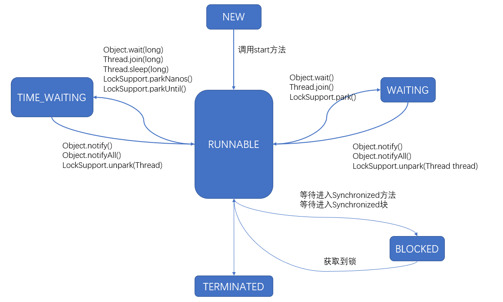

# 线程
[TOC]

##  一、Java Memeory Model内存模型


当前的JMM内存模型规范主要基于JDK5开始的新的内存模型JSR-133，Java Memory Model总的来说是一个规范，并不是具体的实现，无法与JVM的内存模型进行类比，它的主要描述就是所有的变量都存储在主内存中，模型中的每个线程都有自己的本地内存（抽象概念，涵盖了缓存区，寄存器以及其他的硬件和编译器优化），本地内存中存储了当前线程操作的变量的副本，线程访问的时候不是访问主存中的变量，而是访问本地内存中的变量拷贝。
Java内存模型除了定义了一套规范，还提供了一系列的原语供开发者使用。

JMM所提供的原语有：`原子性`、`可见性`和`有序性`。

```
+ 原子性：就是位于代码块内的一系列操作，要么全部执行掉、要么都不执行，JMM提了Synchronized关键字保证了方法和代码块内的原子性操作。
+ 可见性：不同的线程之间工作内存都有一份变量的拷贝，同一个变量在不同线程的本地内存的拷贝不一定是最新的，所以需要一种机制将更新后的变量马上刷新回主存，并通知其他线程缓存的变量失效，更新变量的最新值。JMM提供了volatile关键字保证了内存可见性，除了volatile,final和Synchronized也有响应的机制保证内存可见性，但是实现方式不一样。
+ 有序性：为了保证程序按照代码的顺序执行，JMM提供了Synchronized和volatile保证了多线程之间的有序性。volatile关键字禁止了指令的重排序保证了有序性（单例模式中的双检锁就是采用了这种方法），而Synchronized关键字保证了同一时刻只能有一个线程操作。
```

> 个人认为final域也可以禁止指令重排序，在《JVM并发编程的艺术》中写到，当final域为基本数据类型时，final域的写final域的重排序规则表明禁止把final域的写重排序到构造函数之外（如果在构造函数内进行初始化的话），也就是在构造函数return之前，插入一个StoreStore屏障。对final域的读重排序就是在一个线程中，初次读对象引用与初次读该对象包含的final域（两个操作1、初次读对象引用，2、初次读该对象包含的final域），JMM禁止处理器重排序这两个操作，即编译器会在读final域操作的前面插入一个LoadLoad屏障。

## 二、线程的状态
### 线程的构造方法

线程的构造方法有三种：
+ 继承Thread类（本身实现了Runnable接口）
+ 实现Runnable接口
+ 实现Callable接口（如果执行计算完毕后带有返回值，就采用这种方法）

实现Runnable/Callable接口的类只能当做被线程执行的一个任务体，最后还是需要通过Thread类来执行。

#### 实现Callable接口

```java
    static class MyCallable implements Callable<Integer> {
        @Override
        public Integer call() throws Exception {
            return 5;
        }
    }
    public static void main(String[] args) throws InterruptedException, ExecutionException {
        MyCallable c = new MyCallable();
        FutureTask<Integer> result = new FutureTask<>(c);
        Thread a = new Thread(result);
        a.start();
        System.out.println(result.get());
    }
```

#### 实现接口VS继承Thread类

推荐采用实现接口的方式

+ 在Java中对类的继承是单继承，如果继承了Thread类，就再也无法继承其他类。如果当前线程有继承其他类的需求，那么需要使用实现Runnable/Callable接口的方式才创建线程。
+ 继承整个Thread类的开销过大，如果只是需要重写`run()`方法的话，采用实现Runnable/Callable接口即可。

### 线程的状态
线程的状态形式分为：NEW、RUNNABLE、WAITING、TIME_WAITING、TERMINATED、BLOCKED


上图中，在调用wait方法后，线程的状态变为WAITING/TIME_WAITING状态，因为调用wait方法必须要获取到锁，所以再调用到wait方法后，当前线程进入这个锁的等待队列。
当调用notify()方法后，线程的状态从WAITING/TIME_WAITING状态变为BLOCKED状态，但是当前线程获取的锁不会马上释放，等当前方法执行完后，其他线程开始争夺锁。

## 三、线程中断
线程中断相关的方法有
```java
// 中断线程
public void interrupt()
// 判断线程是否中断
public boolean isInterrupted()
// 静态方法，判断当前线程是否中断，并且清除中断标志位
public static boolean interrupted()
```

```
1.当一个线程处于被阻塞状态或者试图执行一个阻塞操作时，使用Thread.interrupt()方式中断该线程，注意此时将会抛出一个InterruptedException的异常，同时中断状态将会被复位(由中断状态改为非中断状态)
2.处于运行期且非阻塞的状态的线程，这种情况下，直接调用Thread.interrupt()中断线程是不会得到任响应的，在这种情况下，中断标志位已经置位，需要在线程内手动判断，或者线程执行到（sleep,wait,join）方法时，抛出InterruptException异常，并且置位中断标志位。
```
## 四、Synchronized和线程中断的关系
在《Java并发编程的艺术》中提到了Lock接口提供了Synchronized所不具备的特点，具体的汇总如下：
| 锁的方式  | Synchronized | Lock接口  |
| ------ | ------| ------|
| 特性 | 隐式锁 | 显式锁 |
| 在获取到锁的非阻塞状态下(运行期)是否响应中断 | 不响应，如果调用的线程的中断方法没有特殊处理方式的话，当前线程不会响应中断 | 响应，调用Lock接口下lockInterruptibly()方法可以响应中断 |
| 当前线程在阻塞情况下是否响应中断 | 响应 | 响应 |
| 是否可以尝试非阻塞的获取锁 | 不可以 | 可以 |
| 超时获取锁 | 不可以 | 可以 |

## 五、线程的生命周期


## 六、线程间通信

+ 等待通知机制（显示通信）
+ volatile/synchronized（隐式通信）
+ 管道的输入/输出流（传输的媒介为内存，两个线程建立连接）
+ Thread#join()
+ ThreadLocal

### 1.等待通知机制

需要获取到锁才能执行的wait()/notify()/notifyAll()。调用wait()方法后，线程进入监视器对应的等待队列，所处的状态为WAITING/TIME_WAITING，调用wait()方法后，当前的线程会立即释放锁和CPU，在调用notify()后，线程的状态转换为BLOCKED，但是当前的线程不会立即释放锁，而是等当前线程执行完任务后才释放。

### 2.隐式通信

根据JMM的特性和它提供的`原子性`、`可见性`、`有序性`的原语，Java是支持多个线程修改同一个共享变量的，每个线程的本地内存缓存的共享变量不一定是最新的，所以采用了volatile关键字。

volatile关键字保证了`可见性`和`原子性`。可见性是指当前线程看到的是共享变量最后一次被更新的结果，原子性指的是对共享变量的读写，不是对共享变量的复合型操作。

#### 使用volatile关键字的场景

在ConcurrentHashMap中保存键值对的Node[] table采用了volatile关键字，它主要保证了多个线程之间的可见性。

同时volatile还有禁止指令重排序的作用，单例模式中双检锁的写法就是利用了volatile禁止重排序的特性。

```JAVA
public class Singleton {
    
    public static volatile Singleton instance;
    
    private Singleton() {
        
    }
    
    public static Singleton getSingleton() {
        if (instance == null) {
            synchronized(Singleton.class) {
                if (instance == null) {
                    /*
                    1.分配对象内存空间
                    2.初始化对象
                    3.设置引用变量instance指向刚刚初始化的对象
                    */
                    instance = new Singleton();
                }
            }
        }
        return instance;
    }
    
    /*
    do other thing
    */
}
```


---

synchronized关键字用于修饰方法和代码块，它确保了多个线程在同一时刻只能有一个线程进入同步区，保证了线程对变量访问的`可见性`和`排他性`。

### 3.管道的输入/输出流

```JAVA
public class Main {

    public static void main(String[] args) throws Exception {
        PipedReader in = new PipedReader();
        PipedWriter out = new PipedWriter();
        out.connect(in);
        Thread a = new Thread(new MyRunnable(in));
        a.start();
        int receive = 0;
        try {
            while ((receive = System.in.read()) != -1) {
                out.write(receive);
            }
        } finally {
            out.close();
        }
    }
    
    static class MyRunnable implements Runnable {

        // 读取字符流
        private PipedReader in;

        public MyRunnable(PipedReader in) {
            this.in = in;
        }
        @Override
        public void run() {
            int receive = 0;
            try {
                while ((receive = in.read()) != -1) {
                    System.out.println((char)receive);
                }
            } catch (IOException e) {

            }
        }
    }

}

```

### 4.Thread#join()

采用join()方法后，当前线程挂起，直到join线程执行完毕。

Thread#join()的使用场景：如果主线程建立了一个子线程，如果子线程执行的计算时间较长，那么主线程可能会先于子线程执行完毕，如果主线程想等待子线程执行完后继续执行，那么就可以采用join的机制。主线程如果开启了子线程，并且join了子线程，如果此时有第三个线程中断了主线程，主线程会抛出`InterruptException`异常。

#### Thread#join()和Thread.sleep的区别

Thread#join()内部是使用了wait(long)的方式实现的，所以Thread#join()会释放锁，Thread.sleep()只会让出当前的CPU，不会释放锁。

### 5.ThreadLocal

```JAVA
public class Main {

    private static ThreadLocal<Integer> local = new ThreadLocal<Integer>() {
        @Override
        protected Integer initialValue() {
            return 0;
        }
    };

    public static void main(String[] args) throws Exception {
        Thread a = new Thread(new Runnable() {
            @Override
            public void run() {
                local.set(3);
                System.out.println(local.get());
                local.set(5);
                System.out.println(local.get());
                local.remove();
                System.out.println(local.get());
            }
        });
        a.start();

        local.set(6);
        TimeUnit.SECONDS.sleep(4);
        System.out.println(local.get());
        local.remove();
        System.out.println(local.get());
    }

}

```


ThreadLocal的作用就是针对每个线程都可以保存一个当前线程想保存的对象，它起到线程隔离的所用。

ThreadLocal的方法有：

+ public void set(T value)，设置当前线程想保存的对象的值
+ public T get()，获取当前线程保存的值
+ public void remove()，将当前线程所保存的值删除，使用完后建议调用，否则会引起内存泄漏。
+ protected T initialValue()，返回该线程所保存的初始值。缺省返回null。

#### ThreadLocal的原理

在ThreadLocal内部有一个内部类`ThreadLocalMap`，内部类中用一个虚引用的数组保存值。

```JAVA
    public void set(T value) {
        Thread t = Thread.currentThread();
        ThreadLocalMap map = getMap(t);
        if (map != null)
            map.set(this, value);
        else
            createMap(t, value);
    }
```

查看ThreadLocal的set方法，存入元素时需要获取当前线程的一个`ThreadLocalMap`，ThreadLocalMap是ThreadLocal的一个静态内部类。调用ThreadLocal#set(T value)方法时，先获取当前线程对应的ThreadLocalMap对象，然后将value值插入该对象中。

查看Thread类，每个线程都会有个ThreadLocal.ThreadLocalMap的引用变量。

```JAVA
    /* ThreadLocal values pertaining to this thread. This map is maintained
     * by the ThreadLocal class. */
    ThreadLocal.ThreadLocalMap threadLocals = null;
```

```JAVA
    void createMap(Thread t, T firstValue) {
        t.threadLocals = new ThreadLocalMap(this, firstValue);
    }
```

通过createMap方法可以看出给每个线程的threadLocals引用变量都指向了一个ThreadLocalMap对象，即每个线程都有一个独立的ThreadLocalMap副本，键为当前ThreadLocal对象。

如果一个线程需要保存多个对象，那么就需要建立多个ThreadLocal对象，不同的ThreadLocal为不同的键。类似于HashMap中，不同的键对应不同的值。

#### ThreadLocal的缺点

ThreadLocal如果不断地创建，使用完后没有调用ThreadLocal#remove()方法，将会导致内存泄漏。

**总结：**每个线程都有一个对应的ThreadLocalMap对象，在这个Map中键为不同的ThreadLocal对象，如果一个线程需要存储不同的对象，那么需要建立多个ThreadLocal对象，每个ThreadLocal对象都作为Map中的键，就可以保存多个值。

建议使用`static`修饰创建的ThreadLocal，这个变量是对一个线程内的所有操作共享，所以设置静态变量，在类被第一次加载的时候装载，只分配一块存储空间。

## 七、锁的优化

锁的优化都是基于synchronized关键字。

### 1.自旋锁

未获取到监视器Monitor，进入阻塞状态的这种情况开销很大，自旋锁的作用就是让未获得锁的线程先不要进入阻塞状态，而是执行循环（自旋）一段时间，如果在这段时间能够获得锁，就可以避免进入阻塞状态。

自旋锁虽然可以减轻进入阻塞状态的开销，但是如果获得锁的线程开销时间较长，处于自旋状态下的线程需要不停的自旋，这是一个耗CPU的操作，所以采用自旋锁比较适合用于任务量较小的场景。

在JDK1.6中还引入了自适应自旋锁，也就是自旋的时间不再是固定的，而是和它前面的自旋情况有关。

### 2.锁消除

虚拟机即时编译器在运行时，在判定共享数据不会发生竞争的情况下会进行锁消除。

锁消除是基于逃逸分析，如果判定堆上的共享数据不可能逃逸出去，被其他线程访问到，那么就将它当成私有数据对待，也就是进行锁消除。

```JAVA
	public String addString(String s1, String s2, String s3) {
        return s1 + s2 + s3;
    }
```

在JDK1.5之前，会将上述代码优化为

```JAVA
	public String addString(String s1, String s2, String s3) {
        StringBuffer sb = new StringBuffer();
        sb.append(s1);
        sb.append(s2);
        sb.append(s3);
        return sb.toString();
    }
```

> 在JDK1.5之前会采用StringBuffer进行字符串的相加操作，StringBuffer的每个操作都带有synchronized关键字，开销很大，在JDK1.5之后，采用了StringBuilder。

### 3.锁粗化

如果虚拟机判断到一系列的操作都是对同一个对象反复的加锁/解锁，或者加锁操作是出现在循环体中的，即使没有线程竞争，频繁的释放锁和添加锁也是高开销的操作，所以会将锁粗化到代码的开头和结尾，即加锁和释放锁只需要一次。

如上面用到StringBuffer的代码块中，三个append操作就不再需要连续加锁/解锁三次，而是将锁粗化到代码的开头和结尾，只进行一次加锁和解锁。

### 4.偏向锁

JDK1.6引入的优化策略

偏向锁主要是应对只有一个线程多次获得所的场景，适用的场景是大多数情况下，不存在多线程竞争锁，而是由同一个线程获得锁，为了让同一个线程获得锁的开销更低引入了偏向锁。

当同一个线程再次尝试获得锁时，如果检测到对象头的Mark Word里面存储的指向当前线程的偏向锁，则无需再进行加锁操作。

偏向锁的撤销会暂停拥有偏向锁的线程，如果程序中的锁总是被多个线程请求，那么偏向模式就是多余的，可以通过`UseBiasedLocking=false`取消偏向锁。

### 5.轻量级锁

轻量级锁的加锁和解锁都需要用到CAS。

**加锁**

+ 当前线程的栈帧中创建用于存储锁记录的空间
+ 对象头的Mark Word复制到锁记录中（Displayed Mark Word）
+ 采用CAS将对象头的Mark Word替换为指向锁记录的指针，如果成功拿到轻量级锁，如果没有成功，通过自旋来获取锁。

**解锁**

+ CAS操作将栈帧中的Displayed Mark Word替换回到对象头，如果成功，无竞争发生，如果失败，表示当前存在锁竞争，锁会膨胀为重量级锁。

| 锁 | 优点 | 缺点 | 使用场景 |
| ------ | ------ | ------ | ------ |
| 偏向锁 | 加锁/解锁消耗低 | 线程间存在锁竞争，撤销锁需要额外的开销 | 只有一个线程或得锁的场景 |
| 轻量级锁 | 竞争的线程不会阻塞，提高了程序的响应速度 | 始终得不到锁的线程会自旋的获取锁，占用CPU | 追求响应时间，同步执行速度快 |
| 重量级锁 | 线程竞争不使用自旋，不会消耗CPU | 线程阻塞，响应时间缓慢 | 追求吞吐量，同步执行时间长 |

## 七、线程池

线程的池化技术主要目的是为了优化线程的使用，线程作为非常宝贵的资源，无节制的创建使用是非常不科学的，这就需要一个容器进行管理，促进线程的复用。

线程池的优点：

+ 降低资源消耗，重复的创建线程开销较大，而利用已经创建好的线程可以降低开销
+ 提高响应速度，任务到达时，通过复用已经创建好的线程，可以提高响应速度
+ 提高线程的可管理性，限制了线程无节制的创建，进行统一调配、监控和管理。

线程池的工作流程：

1. 小于核心线程数（corePoolSize）就创建线程
2. 大于核心线程数后，将任务添加进阻塞队列
3. 阻塞队列添加满任务后，如果当前线程数少于最大线程数，那么就继续创建线程。
4. 如果达到最大线程数，就执行拒绝策略

线程池的参数：

corePoolSize、maximumPoolSize、keepAliveTime、TimeUnit unit、BlockingQueue workQueue、threadFactory、RejectedExecutionHandler handler


ThreadPoolExecutor类属于线程池的实现类，Executors类下面的newFixedThreadPool、newSingleThreadExecutor、newCachedThreadPool都是基于ThreadPoolExecutor来实现的。

### ThreadPoolExecutor源码分析

#### 1. 基本信息

ThreadPoolExecutor内部采用了一个原子类`AtomicInteger`保存了线程池的状态和线程的数量。

```JAVA
    // 采用了一个原子类
	private final AtomicInteger ctl = new AtomicInteger(ctlOf(RUNNING, 0));
    private static final int COUNT_BITS = Integer.SIZE - 3;
    private static final int CAPACITY   = (1 << COUNT_BITS) - 1;

    // runState is stored in the high-order bits
    private static final int RUNNING    = -1 << COUNT_BITS;
    private static final int SHUTDOWN   =  0 << COUNT_BITS;
    private static final int STOP       =  1 << COUNT_BITS;
    private static final int TIDYING    =  2 << COUNT_BITS;
    private static final int TERMINATED =  3 << COUNT_BITS;

    // Packing and unpacking ctl
    private static int runStateOf(int c)     { return c & ~CAPACITY; }
    private static int workerCountOf(int c)  { return c & CAPACITY; }
    private static int ctlOf(int rs, int wc) { return rs | wc; }
```

#### 2.线程池的执行方法

```JAVA
    public void execute(Runnable command) {
        if (command == null)
            throw new NullPointerException();
        /*
         * Proceed in 3 steps:
         *
         * 1. If fewer than corePoolSize threads are running, try to
         * start a new thread with the given command as its first
         * task.  The call to addWorker atomically checks runState and
         * workerCount, and so prevents false alarms that would add
         * threads when it shouldn't, by returning false.
         *
         * 2. If a task can be successfully queued, then we still need
         * to double-check whether we should have added a thread
         * (because existing ones died since last checking) or that
         * the pool shut down since entry into this method. So we
         * recheck state and if necessary roll back the enqueuing if
         * stopped, or start a new thread if there are none.
         *
         * 3. If we cannot queue task, then we try to add a new
         * thread.  If it fails, we know we are shut down or saturated
         * and so reject the task.
         */
        int c = ctl.get();
        // 比较当前线程的数量是否小于核心线程数
        if (workerCountOf(c) < corePoolSize) {
            if (addWorker(command, true))
                return;
            c = ctl.get();
        }
        // 判断当前线程池是否处于Running状态，并且加入workQueue
        if (isRunning(c) && workQueue.offer(command)) {
            int recheck = ctl.get();
            // 如果不是Running状态,则将任务移除
            if (! isRunning(recheck) && remove(command))
                reject(command);
            else if (workerCountOf(recheck) == 0)
                addWorker(null, false);
        }
        // 如果无法添加非核心线程，即线程池已达到规定的最大线程数，则执行拒绝策略
        else if (!addWorker(command, false))
            reject(command);
    }
```

#### 3.工作线程的创建/执行/清除方法

```JAVA
    private boolean addWorker(Runnable firstTask, boolean core) {
        retry:
        // 两层for循环，外层循环判断当前线程池的状态，内层循环通过CAS添加线程的计数
        for (;;) {
            int c = ctl.get();
            int rs = runStateOf(c);

            // Check if queue empty only if necessary.
            if (rs >= SHUTDOWN &&
                ! (rs == SHUTDOWN &&
                   firstTask == null &&
                   ! workQueue.isEmpty()))
                return false;

            for (;;) {
                int wc = workerCountOf(c);
                if (wc >= CAPACITY ||
                    wc >= (core ? corePoolSize : maximumPoolSize))
                    return false;
                // 线程数加一
                if (compareAndIncrementWorkerCount(c))
                    break retry;
                c = ctl.get();  // Re-read ctl
                if (runStateOf(c) != rs)
                    continue retry;
                // else CAS failed due to workerCount change; retry inner loop
            }
        }

        boolean workerStarted = false;
        boolean workerAdded = false;
        Worker w = null;
        try {
            w = new Worker(firstTask);
            final Thread t = w.thread;
            if (t != null) {
                final ReentrantLock mainLock = this.mainLock;
                mainLock.lock();
                try {
                    // Recheck while holding lock.
                    // Back out on ThreadFactory failure or if
                    // shut down before lock acquired.
                    int rs = runStateOf(ctl.get());

                    if (rs < SHUTDOWN ||
                        (rs == SHUTDOWN && firstTask == null)) {
                        if (t.isAlive()) // precheck that t is startable
                            throw new IllegalThreadStateException();
                        workers.add(w);
                        int s = workers.size();
                        if (s > largestPoolSize)
                            largestPoolSize = s;
                        workerAdded = true;
                    }
                } finally {
                    mainLock.unlock();
                }
                if (workerAdded) {
                    t.start();
                    workerStarted = true;
                }
            }
        } finally {
            if (! workerStarted)
                addWorkerFailed(w);
        }
        return workerStarted;
    }

```

#### 4.Work类的构造

```JAVA
    private final class Worker
        extends AbstractQueuedSynchronizer
        implements Runnable
    {
        /**
         * This class will never be serialized, but we provide a
         * serialVersionUID to suppress a javac warning.
         */
        private static final long serialVersionUID = 6138294804551838833L;

        /** Thread this worker is running in.  Null if factory fails. */
        final Thread thread;
        /** Initial task to run.  Possibly null. */
        Runnable firstTask;
        /** Per-thread task counter */
        volatile long completedTasks;

        /**
         * Creates with given first task and thread from ThreadFactory.
         * @param firstTask the first task (null if none)
         */
        Worker(Runnable firstTask) {
            setState(-1); // inhibit interrupts until runWorker
            this.firstTask = firstTask;
            this.thread = getThreadFactory().newThread(this);
        }

        /** Delegates main run loop to outer runWorker  */
        public void run() {
            runWorker(this);
        }

        // Lock methods
        //
        // The value 0 represents the unlocked state.
        // The value 1 represents the locked state.

        protected boolean isHeldExclusively() {
            return getState() != 0;
        }
			
		// 可以看出是不可重入的
        protected boolean tryAcquire(int unused) {
            if (compareAndSetState(0, 1)) {
                setExclusiveOwnerThread(Thread.currentThread());
                return true;
            }
            return false;
        }

        protected boolean tryRelease(int unused) {
            setExclusiveOwnerThread(null);
            setState(0);
            return true;
        }

        public void lock()        { acquire(1); }
        public boolean tryLock()  { return tryAcquire(1); }
        public void unlock()      { release(1); }
        public boolean isLocked() { return isHeldExclusively(); }

        void interruptIfStarted() {
            Thread t;
            if (getState() >= 0 && (t = thread) != null && !t.isInterrupted()) {
                try {
                    t.interrupt();
                } catch (SecurityException ignore) {
                }
            }
        }
    }
```

线程池内部有一个Worker类，主要是线程池的任务执行体，它继承了`AbstractQueuedSynchronizer`，也就是实现了同步的机制，但是它是不可重入的，这点和ReentrantLock不同。

### 线程池的实现方式对比

Executors提供了一些线程池的应用方案，比如newFixedThreadPool、newSingleThreadExecutor、newCachedThreadPool和newScheduledThreadPool。

不过它们都不建议被使用，容易引发OOM。

| 线程池                 |                      newFixedThreadPool                      | newSingleThreadExecutor |                  newCachedThreadPool                   |               new SheduledThreadPool               |
| ---------------------- | :----------------------------------------------------------: | :---------------------: | :----------------------------------------------------: | :------------------------------------------------: |
| 描述                   |                  创建使用固定线程数的线程池                  | 只产生一个线程的线程池  | 根据需要创建新线程，适用于执行很多短期异步任务的小程序 | 主要用于在给定的延迟之后执行任务，或者定期执行任务 |
| 核心线程数和最大线程数 |                           （n,n）                            |          (1,1)          |                 (0,Integer.MAX_VALUE)                  |              （n,Integer.MAX_VALUE）               |
| 采用的阻塞队列         | LinkedBlockingQueue可以称为有界阻塞队列，但是队列的容量为Integer.MAX_VALUE |   LinkedBlockingQueue   |              SynchronousQueue（没有容量）              |                  DelayedWorkQueue                  |

